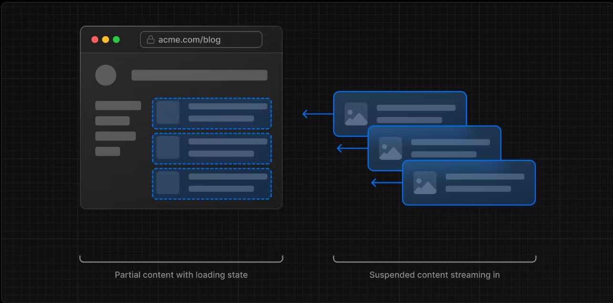
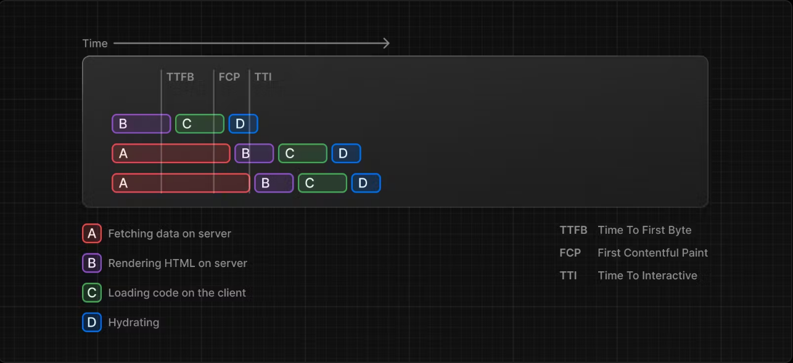

<!--
 * @Author: lzy-Jerry
 * @Date: 2023-07-19 11:23:46
 * @LastEditors: lzy-Jerry
 * @LastEditTime: 2023-07-21 14:48:30
 * @Description: 
-->
next原理是什么？
html是由服务端解析构建的，前端只负责渲染，这样会不会给服务端带来额外的负担
项目是如何构建部署的？

路由（如何构建和react有什么不同？）
文件系统路由按照文件目录划分，文件目录是什么样的路由就是什么样的（咋那么像php呢小声bb...）

***app router***

以文件夹来划分路由每个文件夹对应着链接上/的一节，app对应着根路由root /，在app文件夹下的都是服务端渲染的组件；

路由节点
每个文件夹都对应着url上的一截路径；

路由定义
路由文件下包含 

容器&页面
- Templates：和layout类似更为常见的是当作页面的布局，但不会保存状态交互，当某个路由进入该template时会重新创建一个template实例重新渲染和加载所有的子组件，除非有特殊场景否则一般推荐使用layout；
- Layouts：一个layout可能对应着多个页面，首次加载layout之后会保存state、组件交互以及再次加载时不会重新渲染；
  - app文件夹下的layout是整个应用的根，必须包含html和body片段；
  - 在layout中无法向children传递数据，但是layout可以请求数据，当父layout和子layout请求相同的请求时react会自动去重达到优化的目的；
  - layout的优先级高于page，在同一个文件夹中的layout会自动包裹page；
  - 每个文件夹都可以定义他们自己的layout，当子路由被激活时会渲染子路由中的layout以及他们的内容；
- Pages：每个文件夹下的page.js对应当前路由
  - 默认的page是服务端渲染的组件；
  - 一般会在page文件下请求数据；

导航
- <Link>
  - 本质是由a标签封装而成，因此也通过href来跳转指定连接，也可以通过拼接query的方式动态设置跳转路由；
  - 在客户端渲染的组件中可以使用usePathname来获取当前路由；
- useRouter
  - 和react-router的类似不再赘述；
  - 在使用上述跳转路由时由于next崇尚的是部分更新，所以只改变layout变化的部分，其他部分都不会发生改变不会重新请求数据也不会重新渲染；

- 软导航：如果在一次导航时发现导航的路由路径（路径可以是params相同也可以是query相同）是之前导航过的那么会走缓存；
- 硬导航：从服务端重新请求重新渲染新的页面；
- Prefetching：当某个页面使用Link标签或useRouter().prefetch()的页面在访问之前会在后台预请求该页面的接口并缓存到客户端中；
  - 如果路由是静态路由，那么路由跳转的时候所有的服务端渲染的组件都会被prefetch；
  - 如果是动态路由，会等到第一个loading.js加载之后才会prefetch（不太理解啥意思）；
  - prefetch只在生产环境下生效；
  - Link可以通过传入prefetch={false}关闭prefetch；
路由组
路由组可以定义app下的路由而不会与url形成映射；
动态路由
- 单片段动态路由：需要在文件夹下定义名为[id]的文件名，表示这一片段为动态，url路径片段映射的内容由page呈现；
- 多片段动态路由：需要在文件夹下定义名为[...id]的文件名；
- 可选参数动态路由：可选参数`[[...id]]` 与 [...id]不同的地方在于这个路由可以不传params，不能同时存在；

loading & streaming
- loading
  - 一般会包裹layout或page通过Suspense；
  - 一般用于导航时路由未加载出来时的pendding状态；
- streaming：在ssr中所有与数据有关的组件都会由服务端渲染，那么如果一个页面复杂且所有的数据都需要由服务端渲染，那么从发送请求html到等待服务端渲染完成后会需要很长的时间才能看到页面，此时我们可以通过分块的思想将整个页面拆分更小的chunks让服务端渲染一小块客户端就呈现一小块大大提高了加载效率；
  - 流模式中一般需要结合suspense使用，与数据相关的组件优先级会低于静态交互组件；
  - 
  - 
  - 
  - 目前还没太看出来差别；

error 处理
- error：在子路由中自动捕获路由中抛出的异常层级在路由段layout或template之下，路由段中的error会冒泡到最近的error组件中捕获；
- global error：用于捕获app目录下的layout或template中抛出的错误必须声明为`global-error`层级在layout或template之上，其次在app/global-error必须加上html和body标签，因为在app/layout或template中抛出错误时，global error会捕获此时的ge替换了根节点的layout和template所以需要html和body；
- 无论时服务端渲染组件还是客户端渲染的组件抛出的异常都会通过props传入`<Error />`中；
  - 服务端在生产环境的error会更为泛化，开发环境下更详细便于调试；
refer to  https://www.sitepoint.com/next-js-error-handling-app-router/

Q：那这里可以使用客户端渲染的组件吗？
Q：template和layout的区别？
当某个template承载的路由被激活时所有的内容都会重新渲染加载；
而layout则会走缓存保存状态交互和数据；

***page router***

渲染原理是什么，和react有什么不同？
    既包含服务端渲染也包含客户端渲染；
    服务端渲染组件：由服务端渲染的组件；
        - 与数据有关的组件需要发送请求的组件；
        - 静态的模板类型的组件例如layout组件；
        - 使用了后端资源的组件；
        - 使用了敏感信息的组件（access tokens, API keys, etc）；
        - 需要减少客户端js bundle大小的场景；
    客户端渲染组件：由客户端也就是浏览器渲染的组件，客户端组件也可以在服务器端预渲染之后在客户端呈现；
        - 有动态交互的组件；
        - 只调用了浏览器api的组件；
        - 使用了hook、class的组件；
        - 需要调用一些事件处理的组件；
        - 与hook相关需要依赖state、effect、浏览器api的组件；
    默认会使用服务端渲染组件，当组件使用'use client'时它的整颗组件树都会被认定为客户端渲染即使子组件是服务端渲染组件；
        - 服务端渲染组件在客户端组件中使用时，需要通过props以及插槽的方式传入，否则将无法生效；
    当服务端渲染组件树嵌入了客户端渲染组件，此时整棵组件树都会被发送到服务端渲染但会跳过客户端渲染的组件；

请求是如何发送的？

next作为ssr框架有哪些特点？

和react有什么不同？